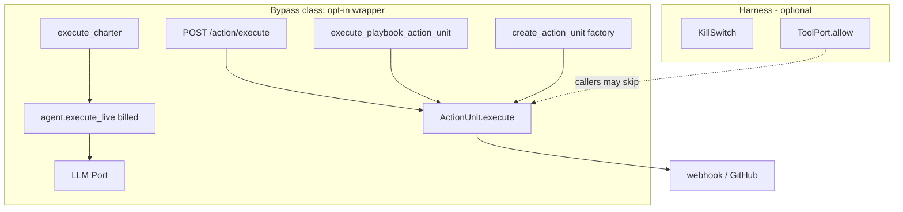

# SPEC — Halt Law (v2.5.0)

**Authority:** Spec-Anchored  
**Constitution:** Articles I, VI, IX  
**Skills:** flowchartcharter-engineering · loop-engineer · rhythm-marker-validator · graphify · graphrag-pipeline (sub-flow only)

## Line-by-line of the ask (Phase 1)

| Line | Meaning | Do |
|---|---|---|
| Analyze HALT bypass vectors | Find every path that fires a side-effect without the stop button | Map, then close |
| /deep-research | 2026 kill-switch + CBSE (config sandbox escape): optional wrappers are bypasses | Chokepoint, not wrapper |
| raise everything mentioned above | Audit 5.5: hot path, persist, earned quality, honest retrieval | Those four. Not Leiden |
| surpass GraphRAG | Different sport. Win on unavoidable halt + contracts, not retrieval | GraphRAG stays sub-flow |
| execute | Build after this spec | v2.5.0 |

## Research (short)

A kill switch that callers can skip is not a kill switch. 2026 CBSE work (Cymulate) and agent-attack-surface papers say the same thing: isolation dies at the **config / alternate-path** layer, not the kernel. The New Stack: fail-open vs fail-closed is the actual design choice. Hugging Face / sandbox-escape coverage: restart amnesia re-arms the car.

**FCC vectors found in code**

1. API constructs a unit and calls `execute()` — no KillSwitch.  
2. Playbook ActionUnits same.  
3. `dry_run=False` on the request body overrides the playpen.  
4. Halt lives in RAM — restart re-arms.  
5. Notebook lives in RAM — restart forgets.  
6. `0.92` / `0.95` quality is invented, so `done` can lie.  
7. `execute_charter` never looks at the switch.

## 1. Outcomes

1. `ActionUnit.execute()` itself refuses when the process KillSwitch is HALTED. Wrappers are not required.  
2. Sandbox policy forces dry-run even if the caller set `dry_run=False`.  
3. `execute_charter` and `run_compiled_playbook` refuse to start when HALTED.  
4. `execute_live` refuses billed inference when HALTED.  
5. Halt + notebook persist under `FCC_HARNESS_DIR` when persist is on. Restart stays HALTED.  
6. Dry-run quality is **0.90** (schema earned). No 0.92 gift.  
7. Retrieval stamp on charter when payload has `query`. `claimed_graphrag` stays honest.

## 2. Scope

**In:** `kill_law.py`, ActionUnit chokepoint, System / playbook / API / execute_live, notebook persist, earned quality, tests, Studio badge.  
**Out:** Leiden in core, gVisor, vendor SDKs, Studio rewrite, claiming GraphRAG.

## 3. Constraints

- No new runtime deps.  
- Isolated ActionUnit tests still work: default switch is ARMED until someone `halt()`s a bound kernel.  
- Tests set `FCC_HARNESS_PERSIST=0` unless they are the persist test.  
- GraphRAG remains a callable sub-flow.

## 4. Prior decisions (do not reopen)

Charter owns the path. Fear schema-before-HTTP. CFO is the spend brake. KillSwitch is the authority brake. Port honesty. Maker-checker.

## 5. Tasks

1. `kill_law` bind + persist + refuse.  
2. Chokepoint in `ActionUnit.execute` + `execute_action` HALTED status.  
3. Bind from `HarnessKernel`. Persist from `System`.  
4. Charter / playbook / API / live refuse.  
5. Notebook jsonl. Earned quality. Retrieval stamp.  
6. Tests V1–V8 + CXR.

## 6. Verification

`PYTHONPATH=packages/core python3 examples/test_v25_halt_law.py` all pass.  
Prior v2.4 harness tests still pass (version 2.5.0).  
pycodestyle max-line-length 88 on new/edited lines.
